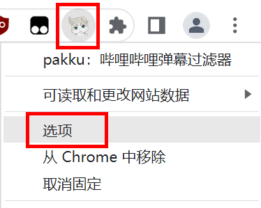
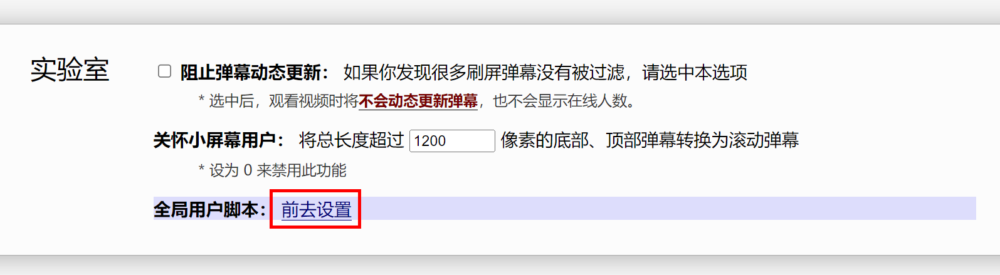
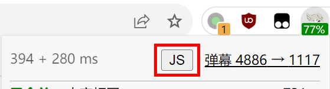
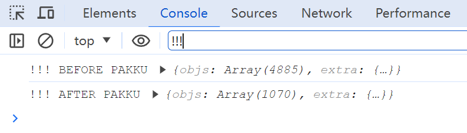
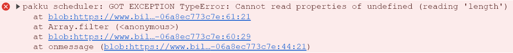
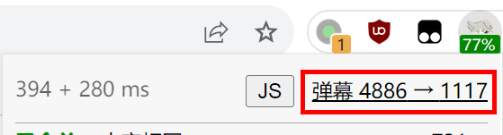

# 用户脚本

用户脚本是一项使用 JavaScript 代码来深度自定义 pakku 的功能。可以定义一些回调函数，它们将在 pakku 处理弹幕之前或之后运行，并修改弹幕内容。

本功能仅面向高级用户，下面将假定你有基本的 JavaScript 编程知识。

## 添加全局用户脚本

全局用户脚本将保存在设置中，对 pakku 处理的所有视频生效，适合希望永久生效的自定义。

要想添加全局用户脚本，请进入选项页面：



勾选页面顶部的【我是高级用户】选项：


然后在【实验室】中点击【全局用户脚本：前去设置】链接，进入用户脚本编辑器：



[受浏览器限制](https://developer.chrome.com/docs/extensions/reference/api/storage#property-sync-sync-QUOTA_BYTES_PER_ITEM)，全局用户脚本的代码长度在经过 gzip 压缩后不能超过 8KB。如果代码量较大，可以考虑以下两种方法：

- 在用户脚本中使用 [`importScripts`](https://developer.mozilla.org/en-US/docs/Web/API/Web_Workers_API/Using_web_workers#importing_scripts_and_libraries) 函数通过 URL 引入外部文件，见下方示例。此时请合理设置 HTTP 缓存来避免拖慢弹幕加载速度。
- 将用户脚本存储在播放器域名的 `localStorage['pakku_extra_userscript']` 中。pakku 会读取其中的代码，并拼接到其他用户脚本的结尾。此时请注意及时备份代码，避免清除浏览器缓存导致代码丢失。

## 添加临时用户脚本

临时用户脚本仅针对特定标签页中的视频生效，关闭标签页或刷新后即失效，适合对个别视频的一次性调整。

要添加临时用户脚本，请在B站视频页面上点击 pakku 图标，然后点击顶部【JS】按钮打开编辑器：



如果没有显示这个按钮，请先在选项页面勾选【我是高级用户】。

## 通过用户脚本来修改弹幕内容

你需要编写一个回调函数，通过参数接收一个弹幕分片（即6分钟以内的弹幕列表），然后直接修改这个分片。

可以选择在把这个回调函数注册到 pakku 处理弹幕之前或之后运行。如果选择在之后运行，此函数可以读取 pakku 的弹幕合并结果。

以下是一个什么都不做的示例用户脚本。

```javascript
tweak_before_pakku(chunk=>{
  console.log('!!! BEFORE PAKKU', chunk);
});

tweak_after_pakku(chunk=>{
  console.log('!!! AFTER PAKKU', chunk);
});
```

保存这个用户脚本后，可以在B站播放器页面按 F12 打开开发者工具，然后在 console 中观察到它被执行了：



回调函数可以直接修改 `chunk` 的内容。

如果注册了多个回调函数，你可能关心回调函数的执行顺序。可以向 `tweak_before_pakku` 和 `tweak_after_pakku` 额外传递一个数字参数表示先后顺序，数字越大则执行顺序越靠后。

```javascript
tweak_before_pakku(chunk=>{console.log('!!! FIRST');}, -1);
tweak_before_pakku(chunk=>{console.log('!!! SECOND');}, 0);
tweak_before_pakku(chunk=>{console.log('!!! THIRD');}, 10);
```

以下是与用户脚本相关的类型定义：

```typescript
type int = number; type float = number; type AnyObject = {[k: string]: any};

interface DanmuObject {
    time_ms: int; // 弹幕在视频中的时间
    mode: int; // 1 滚动, 4 底部, 5 顶部, 6 逆向滚动, 7 特殊, 8 代码, 9 BAS
    fontsize: float; // 字号
    color: int; // 颜色，0xRRGGBB
    sender_hash: string; // 发送者UID的CRC32
    content: string; // 弹幕内容
    sendtime: int; // 弹幕发送时间，UNIX 时间戳
    weight: int; // 权重，低于云屏蔽等级时会被播放器过滤
    id: string; // 弹幕ID，举报等操作使用
    pool: int; // 0 普通, 1 字幕
    extra: { // 协议中的附加字段
        proto_attr?: int | null;
        proto_action?: string | null;
        proto_animation?: string | null;
        proto_colorful?: int | null;
        proto_oid?: int | null;
    };
}
interface DanmuObjectPeer extends DanmuObject {
    pakku: {
        sim_reason: string; // 相似性判断结果
    };
}
interface DanmuObjectRepresentative extends DanmuObject {
    pakku: {
        peers: DanmuObjectPeer[]; // 所有被合并为此弹幕的相似弹幕
        desc: string[]; // 合并时的说明
        disp_str: string; // 弹幕实际显示的内容（不含首尾空格），另外特殊弹幕（mode为7）的content为JSON、此值为其中的文本
    };
}
interface DanmuChunk<ObjectType extends DanmuObject> {
    objs: ObjectType[]; // 此分片包含的弹幕
    extra: { // 协议中的附加字段
        proto_segidx?: int;
        proto_colorfulsrc?: AnyObject[];
        xml_maxlimit?: string;
        xml_chatid?: string;
    };
}

function tweak_before_pakku(callback: (chunk: DanmuChunk<DanmuObject>) => void, timing: number = 0) {}
function tweak_after_pakku(callback: (chunk: DanmuChunk<DanmuObjectRepresentative>) => void, timing: number = 0) {}
function tweak_proto_view(callback: (view: AnyObject) => void, timing: number = 0) {}
```

## 通过用户脚本来修改弹幕元信息

从 2024.6.1 版本起，用户脚本可以通过 `tweak_proto_view` 注册回调函数来修改弹幕元信息，即 api.bilibili.com/x/v2/dm/web/view 请求的响应。

由于它是 B 站播放器的私有 API，pakku 不保证此接口的稳定性，也无法解释每个字段的准确含义。完整的字段列表参见 [Protobuf 定义](../proto_translation/bili-proto.json) 中的 `DmWebViewReply` 类型。

以下是部分功能已知的字段：

- `activityMetas`：播放器内嵌广告，例如视频开头偶尔出现的 “云视听小电视” 贴片广告
- `commandDms`：视频中的互动控件，例如相关视频、投票、打分、一键三连等
- `specialDms`：视频中的特殊弹幕，B 站不会把特殊弹幕混在正常弹幕池中，而是单独上传到 CDN 然后在这个字段中指示特殊弹幕的 URL
- `dmSetting`：播放器的弹幕设置，默认会从 B 站账号同步

## 示例

以下是一些可以利用用户脚本实现的功能。

[时间轴整体偏移](https://github.com/xmcp/pakku.js/issues/271)：

```javascript
const OFFSET_MS = 5000;

tweak_before_pakku(chunk=>{
  for(let dm of chunk.objs)
    dm.time_ms += OFFSET_MS;
});
```

[去除弹幕的彩色效果](https://github.com/xmcp/pakku.js/issues/246)：

```javascript
tweak_after_pakku(chunk=>{
  for(let dm of chunk.objs)
    dm.extra.proto_colorful = 0;
});
```

[修改增大弹幕字号的比例](https://github.com/xmcp/pakku.js/issues/163)：

```javascript
function ENLARGE_RATIO(count) {
    return count>=2 ? 1.5 : 1;
}

tweak_after_pakku(chunk=>{
  for(let dm of chunk.objs) {
    let orig_fontsize = Math.max(...dm.pakku.peers.map(p => p.fontsize));
    dm.fontsize = orig_fontsize * ENLARGE_RATIO(dm.pakku.peers.length);
  }
});
```

[按发送时间过滤弹幕](https://github.com/xmcp/pakku.js/issues/235)：

```javascript
const TARGET_TIME = +new Date('2023/1/1') / 1000;

tweak_before_pakku(chunk=>{
  chunk.objs = chunk.objs.filter(
    dm => dm.sendtime < TARGET_TIME
  );
});
```

[数量低于一定阈值则不合并](https://github.com/xmcp/pakku.js/issues/113)：

```javascript
const THRESHOLD_CONST = 5;

tweak_after_pakku(chunk=>{
    let extracted = [];
    chunk.objs = chunk.objs.filter(dm=>{
        if(dm.pakku.peers.length>1 && dm.pakku.peers.length<THRESHOLD_CONST) {
            extracted.push(...dm.pakku.peers.map(p=>({
                // from DanmuObjectPeer to DanmuObjectRepresentative
                ...p,
                pakku: {
                    peers: [p],
                    desc: [...dm.pakku.desc, '已手动取消合并'],
                    disp_str: p.content,
                },
            })));
            return false; // extract then remove
        } else {
            return true; // keep
        }
    });
    chunk.objs.push(...extracted);
});
```

[在用户脚本中引入外部文件](https://github.com/xmcp/pakku.js/issues/288)：

```javascript
importScripts('https://s.xmcp.ltd/sample/large_data.js');
// ↑ const LARGE_DATA = ['hello', 'world'];

let regexps = LARGE_DATA.map(s => new RegExp(s, 'i'));

tweak_before_pakku(chunk=>{
  chunk.objs = chunk.objs.filter(d=>
    !regexps.some(r => r.test(d.content))
  );
});
```

去除一键三连控件和贴片广告：

```javascript
tweak_proto_view(view=>{
    view.commandDms = view.commandDms.filter(d => d.command!=='#ATTENTION#');
    view.activityMetas = [];
});
```

非硬核会员启用 “硬核会员弹幕模式” 选项：

```javascript
tweak_proto_view(view=>{
    view.dmSetting.seniorModeSwitch = 3;
});
```

## 调试

如果用户脚本执行出错，pakku 图标上将出现红色角标，点击可以查看错误信息：


错误信息也会打印在网页的 console 中：



可以使用任何调试 JavaScript 程序的手段来调试用户脚本，比如使用 `debugger;` 语句来下断点：


调试临时用户脚本时请注意不要刷新视频页面，因为临时用户脚本会在刷新时被删除。如果确实需要刷新，可以在用户脚本编辑器页面再次点击【保存】，从而刷新页面且不删除临时用户脚本。

点击 pakku 界面的 “弹幕 x → x” 链接可以单独打开一个网页查看 pakku 的运行结果，这可能对编写用户脚本有所帮助：


