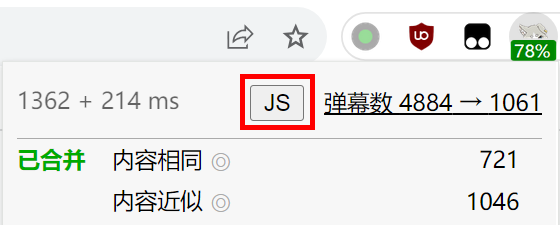

# 用户脚本

用户脚本是一项使用 JavaScript 代码来深度自定义 pakku 的功能。可以定义一些回调函数，它们将在 pakku 处理弹幕之前或之后运行，并修改弹幕内容。

本功能仅面向高级用户，下面将假定你有基本的 JavaScript 编程知识。

## 添加全局用户脚本

全局用户脚本将保存在设置中，对 pakku 处理的所有视频生效，适合希望永久生效的自定义。

要想添加全局用户脚本，请进入选项页面：


勾选页面顶部的【我是高级用户】选项：


然后在【实验室】中点击【全局用户脚本：前去设置】链接，进入用户脚本编辑器：


## 添加临时用户脚本

临时用户脚本仅针对特定标签页中的视频生效，关闭标签页或刷新后即失效，适合对个别视频的一次性调整。

要添加临时用户脚本，请在B站视频页面上点击 pakku 图标，然后点击顶部【JS】按钮打开编辑器：



如果没有显示这个按钮，请先在选项页面勾选【我是高级用户】。

## 编写用户脚本

你需要编写一个回调函数，通过参数接收一个弹幕分片（即6分钟以内的弹幕列表），然后直接修改这个分片。

可以选择在把这个回调函数注册到 pakku 处理弹幕之前或之后运行。如果选择在之后运行，此函数可以读取 pakku 的弹幕合并结果。

以下是一个什么都不做的示例用户脚本。

```javascript
tweak_before_pakku(chunk=>{
  console.log('!!! BEFORE PAKKU', chunk);
});

tweak_after_pakku(chunk=>{
  console.log('!!! AFTER PAKKU', chunk);
});
```

保存这个用户脚本后，可以在B站播放器页面按 F12 打开开发者工具，然后在 console 中观察到它被执行了：


回调函数可以直接修改 `chunk` 的内容。

如果注册了多个回调函数，你可能关心回调函数的执行顺序。可以向 `tweak_before_pakku` 和 `tweak_after_pakku` 额外传递一个数字参数表示先后顺序，数字越大则执行顺序越靠后。

```javascript
tweak_before_pakku(chunk=>{console.log('!!! FIRST');}, -1);
tweak_before_pakku(chunk=>{console.log('!!! SECOND');}, 0);
tweak_before_pakku(chunk=>{console.log('!!! THIRD');}, 10);
```

以下是与用户脚本相关的类型定义：

```typescript
type int = number; type float = number; type AnyObject = {[k: string]: any};

interface DanmuObject {
    time_ms: int; // 弹幕在视频中的时间
    mode: int; // 1 滚动, 4 底部, 5 顶部, 6 逆向滚动, 7 特殊, 8 代码, 9 BAS
    fontsize: float; // 字号
    color: int; // 颜色，0xRRGGBB
    sender_hash: string; // 发送者UID的CRC32
    content: string; // 弹幕内容
    sendtime: int; // 弹幕发送时间，UNIX 时间戳
    weight: int; // 权重，低于云屏蔽等级时会被播放器过滤
    id: string; // 弹幕ID，举报等操作使用
    pool: int; // 0 普通, 1 字幕
    extra: { // 协议中的附加字段
        proto_attr?: int | null;
        proto_action?: string | null;
        proto_animation?: string | null;
        proto_colorful?: int | null;
        proto_oid?: int | null;
    };
}

interface DanmuObjectPeer extends DanmuObject {
    pakku: {
        sim_reason: string; // 相似性判断结果
    };
}
interface DanmuObjectRepresentative extends DanmuObject {
    pakku: {
        peers: DanmuObjectPeer[]; // 所有被合并为此弹幕的相似弹幕
        desc: string[]; // 合并时的说明
        disp_str: string; // 弹幕实际显示的内容，特殊弹幕（mode为7）的content为JSON、此值为实际显示的文本，其他情况两者相同
    };
}

interface DanmuChunk<ObjectType extends DanmuObject> {
    objs: ObjectType[];
    extra: { // 协议中的附加字段
        proto_segidx?: int;
        proto_colorfulsrc?: AnyObject[];
        xml_maxlimit?: string;
        xml_chatid?: string;
    };
}

function tweak_before_pakku(callback: (chunk: DanmuChunk<DanmuObject>) => void, timing: number = 0) {}
function tweak_after_pakku(callback: (chunk: DanmuChunk<DanmuObjectRepresentative>) => void, timing: number = 0) {}
```

## 示例

以下是一些可以利用用户脚本实现的功能。

[时间轴整体偏移](https://github.com/xmcp/pakku.js/issues/271)：

```javascript
const OFFSET_MS = 5000;

tweak_before_pakku(chunk=>{
  for(let dm of chunk.objs)
    dm.time_ms += OFFSET_MS;
});
```

[去除弹幕的彩色效果](https://github.com/xmcp/pakku.js/issues/246)：

```javascript
tweak_after_pakku(chunk=>{
  for(let dm of chunk.objs)
    dm.extra.proto_colorful = 0;
});
```

[修改增大弹幕字号的比例](https://github.com/xmcp/pakku.js/issues/163)：

```javascript
function ENLARGE_RATIO(count) {
    return count>=2 ? 1.5 : 1;
}

tweak_after_pakku(chunk=>{
  for(let dm of chunk.objs) {
    let orig_fontsize = Math.max(...dm.pakku.peers.map(p => p.fontsize));
    dm.fontsize = orig_fontsize * ENLARGE_RATIO(dm.pakku.peers.length);
  }
});
```

[按发送时间过滤弹幕](https://github.com/xmcp/pakku.js/issues/235)：

```javascript
const TARGET_TIME = +new Date('2023/1/1') / 1000;

tweak_before_pakku(chunk=>{
  chunk.objs = chunk.objs.filter(
    dm => dm.sendtime < TARGET_TIME
  );
});
```

[数量低于一定阈值则不合并](https://github.com/xmcp/pakku.js/issues/113)：

```javascript
const THRESHOLD_CONST = 5;

tweak_after_pakku(chunk=>{
    let extracted = [];
    chunk.objs = chunk.objs.filter(dm=>{
        if(dm.pakku.peers.length>1 && dm.pakku.peers.length<THRESHOLD_CONST) {
            extracted.push(...dm.pakku.peers.map(p=>({
                // from DanmuObjectPeer to DanmuObjectRepresentative
                ...p,
                pakku: {
                    peers: [p],
                    desc: [...dm.pakku.desc, '已手动取消合并'],
                    disp_str: p.content,
                },
            })));
            return false; // extract then remove
        } else {
            return true; // keep
        }
    });
    chunk.objs.push(...extracted);
});
```

## 调试

如果用户脚本执行出错，pakku 图标上将出现红色角标，点击可以查看错误信息：


错误信息也会打印在网页的 console 中：


可以使用调试 JavaScript 程序的手段来调试用户脚本，比如使用 `debugger;` 语句来下断点：


调试临时用户脚本时请注意不要刷新播放器，因为临时用户脚本会在刷新时被删除。如果确实需要刷新，可以在用户脚本编辑器页面再次点击【保存】，这样临时用户脚本就不会被删除。
