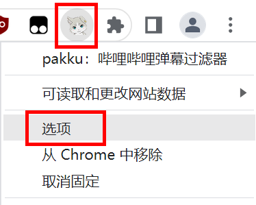
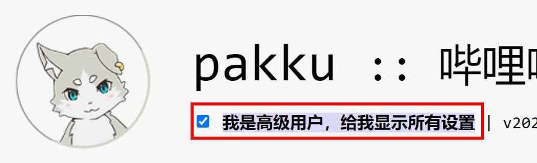
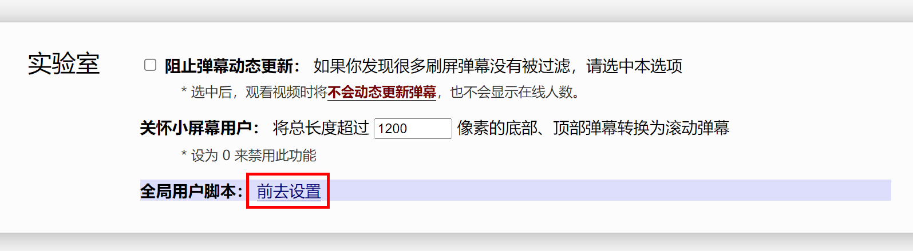
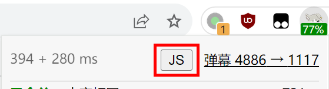
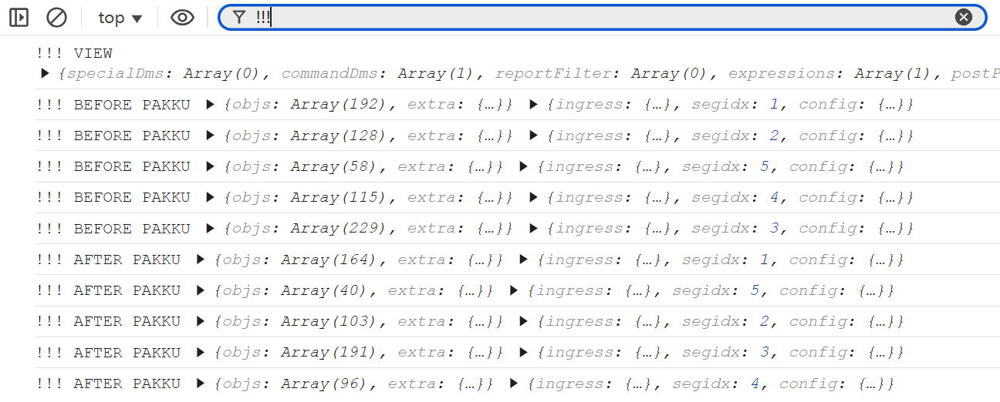
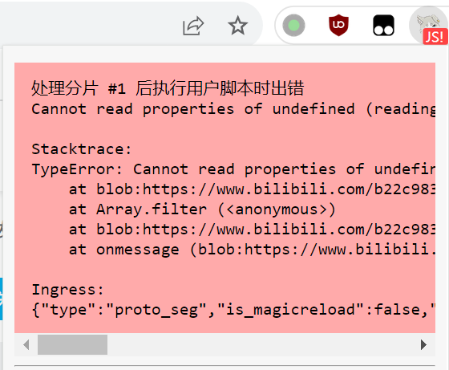
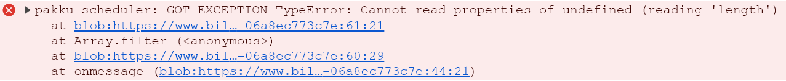
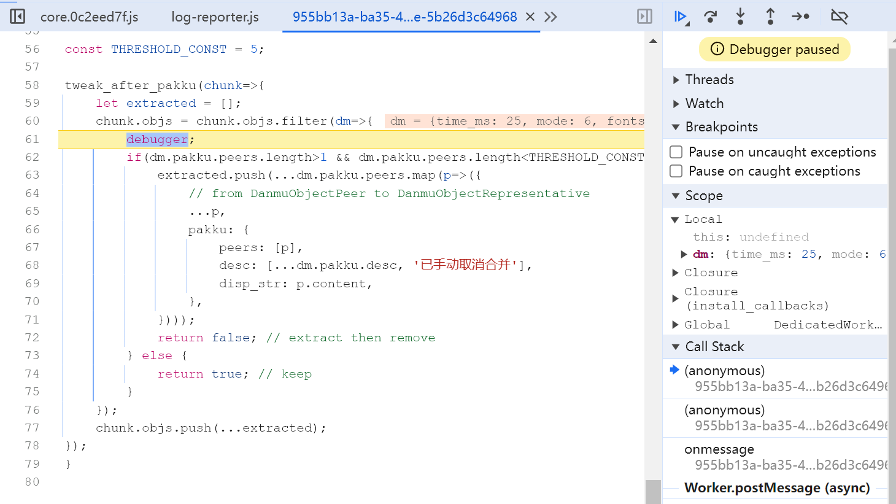
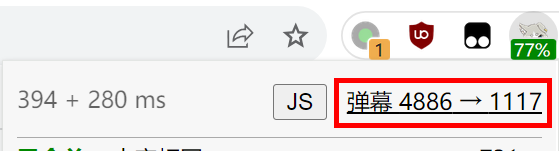

# 用户脚本

> [!NOTE]
> 本功能仅面向高级用户，下面将假定你有基本的 JavaScript 编程知识。

pakku 的核心功能是对 B 站弹幕中的重复内容进行合并及其他处理。一直以来，有一些用户希望能自定义 pakku 的功能（例如 “合并数量为 2 时就不要合并了”），或者借助 pakku 的基础设施实现更多自定义处理（例如 “删除投票弹幕”），为此可以使用 pakku 用户脚本功能。具体来说，你可以定义一些回调函数，它们将在 pakku 处理弹幕之前或之后运行，并修改弹幕内容或者回传信息到页面上。

## 用户脚本的三种类型

### 全局用户脚本

全局用户脚本将保存在 pakku 的设置中，对所有视频生效，适合希望全局生效的自定义逻辑，比如修改全体弹幕的大小等等。

要想添加全局用户脚本，请进入选项页面：



勾选页面顶部的【我是高级用户】选项：



然后在【实验室】中点击【全局用户脚本：前去设置】链接，进入用户脚本编辑器：



[受浏览器限制](https://developer.chrome.com/docs/extensions/reference/api/storage#property-sync-sync-QUOTA_BYTES_PER_ITEM)，全局用户脚本的代码长度在经过 gzip 压缩后不能超过 6.4KB。如果代码量较大，可以考虑以下两种方法：

- 在用户脚本中使用 [`importScripts`](https://developer.mozilla.org/en-US/docs/Web/API/Web_Workers_API/Using_web_workers#importing_scripts_and_libraries) 函数通过 URL 引入外部文件，见下方示例。此时请合理设置 HTTP 缓存来避免拖慢弹幕加载速度。
- 将用户脚本存储在播放器域名的 `localStorage['pakku_extra_userscript']` 中。pakku 会读取其中的代码，并拼接到其他用户脚本的结尾。此时请注意及时备份代码，避免清除浏览器缓存导致代码丢失。
- 使用下面介绍的 “外部用户脚本” 功能。

### 临时用户脚本

临时用户脚本仅针对特定标签页中的视频生效，关闭标签页或刷新后即失效，适合对个别视频的一次性调整，比如希望临时屏蔽某些时间段之间的弹幕。

要添加临时用户脚本，请在B站视频页面上点击 pakku 图标，然后点击顶部【JS】按钮打开编辑器：



如果没有显示这个按钮，请先在选项页面勾选【我是高级用户】。

### 外部用户脚本

来自 Tampermonkey 等用户脚本管理器的外部用户脚本可能希望注入部分功能到 pakku 中。为此，外部用户脚本可以在 pakku 合并弹幕前（比如 `@run-at document-body`）向视频页面的 HTML 写入一个标签：

```javascript
let script_elem = document.createElement('script');
script_elem.type = 'text/x-pakku-userscript';
script_elem.textContent = `
// 要作为 pakku 用户脚本执行的内容
console.log('!!! HEY I RUN IN PAKKU', pakku_version);
`;
document.documentElement.appendChild(script_elem);
```

pakku 将读取 `<html>` 下相邻级别的所有 `<script type="text/x-pakku-userscript">` 标签，并将所有内容合并到一起作为用户脚本去执行。

“外部用户脚本” 是三种类型中最适合对外分发的一种方式，因为它不需要最终用户对 pakku 进行设置（不需要把脚本粘贴到 pakku 的用户脚本输入框中）。开发者仅需引导最终用户安装 pakku 并使用 Tampermonkey 等工具添加你的 `….user.js` 即可生效。也可以依赖 Tampermonkey 进行自动更新。

[example_histogram.user.js](example_histogram.user.js) 是使用外部用户脚本功能的一个示例，供参考。

请注意，上面虽然说过 pakku 会读取 `localStorage['pakku_extra_userscript']` 作为用户脚本执行，但这个功能的初衷是**用户自己**使用，外部用户脚本请**不要**用。因为多个脚本会互相覆盖 localStorage，而且被卸载时难以清理干净。

### 省流：如何选择？

- 我要做一些对所有视频都生效的自定义 → 全局用户脚本
- 我要对当前视频做临时的自定义 → 临时用户脚本
- 我要做一个带 UI 的功能，或者想发布给别人用 → 外部用户脚本

## 编写用户脚本

### 修改弹幕内容

可以在 pakku 用户脚本中注册回调函数，此函数将通过参数接收 pakku 处理的每个弹幕分片（即6分钟以内的弹幕列表），并可以直接修改这个分片。

回调函数可以注册到 pakku 处理弹幕之前或之后运行（通过 `tweak_before_pakku(callback, t=0)` 或者 `tweak_after_pakku(callback, t=0)`）。如果选择在之前运行，此函数修改的是 pakku 即将处理的原始弹幕列表。如果选择在之后运行，此函数修改的是 pakku 已经处理好的弹幕列表。即运行顺序是：B站弹幕 → `tweak_before_pakku` 回调 → pakku 的过滤、合并、处理流程 → `tweak_after_pakku` 回调 → 显示给用户。

以下是一个什么都不做的示例用户脚本。

```javascript
tweak_before_pakku((chunk, env)=>{
  console.log('!!! BEFORE PAKKU', chunk, env);
});

tweak_after_pakku((chunk, env)=>{
  console.log('!!! AFTER PAKKU', chunk, env);
});
```

保存这个用户脚本后，可以在B站播放器页面按 F12 打开开发者工具，然后在 console 中观察到它被执行了：



其中 `chunk` 是弹幕列表，回调函数可以直接修改此变量的内容来修改弹幕。后面有很多示例。

`env` 是执行时的其他环境信息，包括当前视频（`env.ingress`）、当前弹幕分片的编号（`env.segidx`）和 pakku 设置（`env.config`），供用户脚本参考。请勿修改 `env` 中的内容，因为改了也没用。

如果对同一个事件注册了多个回调函数，你可能关心回调函数的相对执行顺序。可以向 `tweak_before_pakku` 和 `tweak_after_pakku` 传递一个数字参数表示先后顺序，数字越大则执行顺序越靠后。

```javascript
tweak_before_pakku(chunk=>{console.log('!!! FIRST');}, -1);
tweak_before_pakku(chunk=>{console.log('!!! SECOND');}, 0);
tweak_before_pakku(chunk=>{console.log('!!! THIRD');}, 10);
```

回调函数可以是异步的。例如：

```javascript
function sleep(x) {
   return new Promise(resolve => setTimeout(resolve, x));
}

tweak_after_pakku(async (chunk, env)=>{
    console.log('!!! blocking loading of the segment', env.segidx);
    await sleep(2000);
});
```

请根据实际场景选择使用 `tweak_before_pakku` 还是 `tweak_after_pakku`。例如，如果你希望：

- **屏蔽所有一年内发送的弹幕，来防止剧透** → 应该使用 `tweak_before_pakku`。如果用了 `tweak_after_pakku`，万一较早的弹幕和较晚弹幕被合并到一起了，合并后的发送时间字段将是二者的发送时间之一（取决于在视频里出现的顺序），因此有几率漏掉一些弹幕没有被屏蔽。
- **当仅有两条弹幕被合并到一起的时候取消合并，分开显示** → 应该使用 `tweak_after_pakku`。具体来说，应该读取 `pakku.peers` 字段，当数量为 2 时把它们从合并后的弹幕里抽出来。后面的示例将展示如何实现。
- **把所有弹幕的字号放大两倍** → 用 `tweak_before_pakku` 或者 `tweak_after_pakku` 均可。但是如果你开启了 pakku 的 “自动弹幕优选” 等需要计算弹幕密度的功能，由于 `tweak_after_pakku` 是在 pakku 之后运行的，此时 pakku 的相关逻辑会按放大前的字号计算弹幕密度。`tweak_before_pakku` 则可以让 pakku 按放大后的字号计算弹幕密度。请根据实际需求选择。

### 修改弹幕元信息

用户脚本可以通过 `tweak_proto_view(callback, t=0)` 注册回调函数来修改弹幕元信息，即 api.bilibili.com/x/v2/dm/web/view 这个 HTTP 请求的响应。

由于它是 B 站播放器的私有 API，pakku 不保证此接口的稳定性，也无法解释每个字段的准确含义。完整的字段列表参见 [Protobuf 定义](../proto_translation/bili-proto.json) 中的 `DmWebViewReply` 类型。

以下是部分功能已知的字段：

- `commandDms`：视频中的互动控件，例如相关视频、投票、打分、一键三连等
- `specialDms`：视频中的特殊弹幕，B 站不会把特殊弹幕混在正常弹幕池中，而是单独上传到 CDN 然后在这个字段中指示特殊弹幕的 URL
- `dmSetting`：播放器的弹幕设置，默认会从 B 站账号同步
- `subtitle`：视频的字幕信息，会显示在播放器右下角的字幕菜单中

### 把信息回传到页面

有时你可能希望从 pakku 用户脚本向页面发送数据。例如你在开发一个外部用户脚本，有自己的 UI，希望在页面上展示处理结果。为此 pakku 提供了以下两个函数：

- `emit_dom_event(event_name, event_detail={})`：向页面发送 DOM 事件
- `on_pakku_welldone(callback, t=0)`：当 pakku 处理完全部弹幕后、用户脚本销毁前调用此回调函数，时机与 pakku 显示自身 UI 大致相同

比如，当你想得知视频的弹幕总数，可以这样做：

```javascript
// 在pakku用户脚本中
let count = 0;
tweak_after_pakku((chunk)=>{
    count += chunk.objs.length;
});
on_pakku_welldone(()=> {
    emit_dom_event('got_my_danmu_count', {result: count});
});
```

```javascript
// 在页面上
document.documentElement.addEventListener('got_my_danmu_count', (e)=>{
    console.log('!!! 弹幕数量是', e.detail.result);
});
```

[example_histogram.user.js](example_histogram.user.js) 是一个更完整的示例，供参考。

## 开发参考

以下是与用户脚本相关的类型定义：

<!-- DOC-GEN: BEGIN-TYPE-DEF -->
```typescript
type int = number; type float = number; type AnyObject = {[k: string]: any};

interface DanmuObject { // 一条弹幕
    time_ms: int; // 弹幕出现在视频中的时间，单位为毫秒
    mode: int; // 1 滚动, 4 底部, 5 顶部, 6 逆向滚动, 7 特殊, 8 代码, 9 BAS
    fontsize: float; // 字号，默认大小是 25
    color: int; // 颜色，0xRRGGBB
    sender_hash: string; // 弹幕发送者的 UID ，经过 CRC32 哈希
    content: string; // 弹幕内容
    sendtime: int; // 弹幕发送时间，单位为 UNIX 时间戳
    weight: int; // 弹幕权重，范围 0-11，低于云屏蔽等级时会被播放器过滤，启用B站“硬核会员弹幕模式”后仅显示权重为11的弹幕
    id: string; // 弹幕 ID，举报等操作使用
    pool: int; // 0 普通, 1 字幕
    extra: { // 协议中的附加字段，见源码中 proto_translation/bili-proto.json 的 DanmakuElem 类型
        proto_attr?: int | null;
        proto_action?: string | null;
        proto_animation?: string | null;
        proto_colorful?: int | null;
        proto_oid?: int | null;
        proto_dmfrom?: int | null;
        proto_likecount?: int | null; // 点赞数量
    };
}
interface DanmuObjectPeer extends DanmuObject {
    pakku: {
        sim_reason: string; // 相似性判断结果
    };
}
interface DanmuObjectRepresentative extends DanmuObject { // pakku 合并后的一条弹幕，除 DanmuObject 已有字段外新增了合并详情
    pakku: {
        peers: DanmuObjectPeer[]; // 所有被合并为此弹幕的相似弹幕
        desc: string[]; // 合并时的说明
        disp_str: string; // 弹幕实际显示的内容（不含首尾空格），另外特殊弹幕（mode 为 7）的 content 为 JSON、此值为其中的文本
    };
}
interface DanmuChunk<ObjectType extends DanmuObject> { // 一个弹幕分片，包含 6 分钟以内的所有弹幕
    objs: ObjectType[]; // 此分片包含的弹幕
    extra: { // 协议中的附加字段，见源码中 proto_translation/bili-proto.json 的 DmSegMobileReply 类型
        proto_segidx?: int;
        proto_colorfulsrc?: AnyObject[];
        xml_maxlimit?: string;
        xml_chatid?: string;
    };
}

interface Env {
    ingress: AnyObject; // 视频信息，见源码中 protocol/interface.ts 的 Ingress 类型
    segidx: int | null; // 当前弹幕分片的编号，从1开始
    config: AnyObject; // 当前设置，见源码中 core/types.ts 的 LocalizedConfig 类型
}
type Ret = void | Promise<void>; // 支持同步或异步的回调函数，没有返回值，修改弹幕请原地操作

function tweak_before_pakku(callback: (chunk: DanmuChunk<DanmuObject>, env: Env) => Ret, t: number = 0) {}
function tweak_after_pakku(callback: (chunk: DanmuChunk<DanmuObjectRepresentative>, env: Env) => Ret, t: number = 0) {}
function tweak_proto_view(callback: (view: AnyObject, env: Env) => Ret, t: number = 0) {}
function on_pakku_welldone(callback: (env: Env) => Ret, t: number = 0) {}

let pakku_version: string = '20YY.M.N'; // 当前 pakku 的版本号
function emit_dom_event(name: string, detail: any = {}) {}
```
<!-- DOC-GEN: END-TYPE-DEF -->

以下是其他可能对开发用户脚本有帮助的源码：

- [pakkujs/core/types.ts](../pakkujs/core/types.ts)
- [pakkujs/core/userscript.template.js](../pakkujs/core/userscript.template.js)
- [pakkujs/core/userscript.ts](../pakkujs/core/userscript.ts)
- [proto_translation/bili-proto.json](../proto_translation/bili-proto.json)
- [pakkujs/protocol/interface.ts](../pakkujs/protocol/interface.ts)

## 示例

以下是一些可以利用用户脚本实现的功能。

[时间轴整体偏移](https://github.com/xmcp/pakku.js/issues/271)：

```javascript
const OFFSET_MS = 5000;

tweak_before_pakku(chunk=>{
    for(let dm of chunk.objs)
        dm.time_ms += OFFSET_MS;
});
```

[去除弹幕的彩虹颜色效果](https://github.com/xmcp/pakku.js/issues/246)：

```javascript
tweak_after_pakku(chunk=>{
    for(let dm of chunk.objs)
        dm.extra.proto_colorful = 0;
});
```

[修改增大弹幕字号的比例](https://github.com/xmcp/pakku.js/issues/163)：

```javascript
function ENLARGE_RATIO(count) {
    return count>=2 ? 1.5 : 1;
}

tweak_after_pakku(chunk=>{
    for(let dm of chunk.objs) {
        let orig_fontsize = Math.max(...dm.pakku.peers.map(p => p.fontsize));
        dm.fontsize = orig_fontsize * ENLARGE_RATIO(dm.pakku.peers.length);
    }
});
```

[按发送时间过滤弹幕](https://github.com/xmcp/pakku.js/issues/235)：

```javascript
const TARGET_TIME = +new Date('2023/1/1') / 1000;

tweak_before_pakku(chunk=>{
    chunk.objs = chunk.objs.filter(
        dm => dm.sendtime < TARGET_TIME
    );
});
```

[数量低于一定阈值则不合并](https://github.com/xmcp/pakku.js/issues/113)：

```javascript
const THRESHOLD_CONST = 5;

tweak_after_pakku(chunk=>{
    let extracted = [];
    chunk.objs = chunk.objs.filter(dm=>{
        if(dm.pakku.peers.length>1 && dm.pakku.peers.length<THRESHOLD_CONST) {
            extracted.push(...dm.pakku.peers.map(p=>({
                // from DanmuObjectPeer to DanmuObjectRepresentative
                ...p,
                pakku: {
                    peers: [p],
                    desc: [...dm.pakku.desc, '已手动取消合并'],
                    disp_str: p.content,
                },
            })));
            return false; // extract then remove
        } else {
            return true; // keep
        }
    });
    chunk.objs.push(...extracted);
});
```

[在用户脚本中引入外部文件](https://github.com/xmcp/pakku.js/issues/288)：

```javascript
importScripts('https://s.xmcp.ltd/sample/large_data.js');
// ↑ const LARGE_DATA = ['hello', 'world'];

let regexps = LARGE_DATA.map(s => new RegExp(s, 'i'));

tweak_before_pakku(chunk=>{
    chunk.objs = chunk.objs.filter(d=>
        !regexps.some(r => r.test(d.content))
    );
});
```

去除一键三连控件：

```javascript
tweak_proto_view(view=>{
    view.commandDms = view.commandDms.filter(d => d.command!=='#ATTENTION#');
});
```

非硬核会员启用 “硬核会员弹幕模式” 选项：

```javascript
tweak_proto_view(view=>{
    view.dmSetting.seniorModeSwitch = 3;
});
```

[屏蔽投票弹幕和产生的所有投票结果](https://github.com/xmcp/pakku.js/issues/178#issuecomment-2636519563)：

```javascript
tweak_proto_view(view=>{
    view.commandDms = view.commandDms.filter(d => d.command !== '#VOTE#');
});
tweak_before_pakku(chunk=>{
    chunk.objs = chunk.objs.filter(
        dm => dm.extra.proto_dmfrom !== 2 // DmFromType.DmFromCmd
    );
});
```

## 调试

如果用户脚本执行出错，pakku 图标上将出现红色角标，点击可以查看错误信息：



错误信息也会打印在网页的 console 中：



可以使用任何调试 JavaScript 程序的手段来调试用户脚本，比如使用 `debugger;` 语句来下断点：



调试临时用户脚本时请注意不要刷新视频页面，因为临时用户脚本会在刷新时被删除。如果确实需要刷新，可以在用户脚本编辑器页面再次点击【保存】，从而刷新页面且不删除临时用户脚本。

点击 pakku 界面的 “弹幕 x → x” 链接可以单独打开一个网页查看 pakku 的运行结果，这可能对编写用户脚本有所帮助：



## 更新历史

- 2026.5.1：支持从 `<script type="text/x-pakku-userscript">` 读取用户脚本，增加 `on_pakku_welldone`、`emit_dom_event`、`pakku_version`
- 2025.2.1：回调函数支持异步，增加 `env` 参数
- 2024.7.1：支持从 `localStorage['pakku_extra_userscript']` 读取用户脚本
- 2024.6.1：增加 `tweak_proto_view`
- 2024.4.1：用户脚本功能上线
